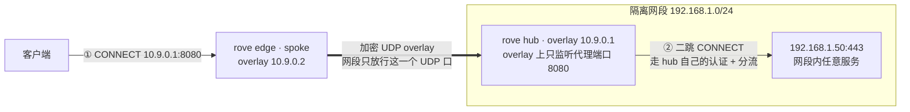
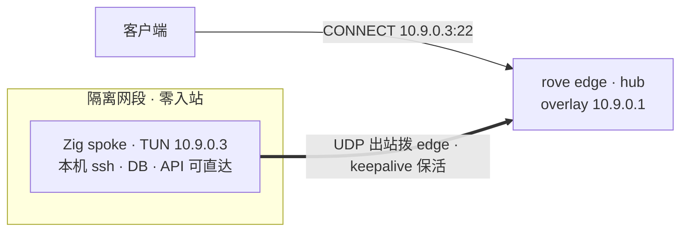
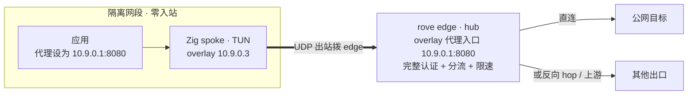

# 最佳实践场景

本章给出几种典型部署拓扑：每个场景说明**什么时候用它、怎么搭、关键配置、要注意什么**。可以直接照抄，也可以
组合使用。

---

## 场景一：单节点纯直连（最简单）

**适用**：只想要一个带用户认证 + 访问日志的正向代理出口，不需要分流。

```text
client ──► rove (认证 + 直连) ──► 目标
```

- 每个用户绑定一个无 route、无 `default_action` 的 routing policy。
- 决策全部落到「直连」。

```jsonc
{
  "schema_version": 1,
  "version": 1,
  "users": { "alice": { "password": "s3cret", "policy": "open" } },
  "routing_policies": { "open": { "routes": [] } },
  "egresses": {}
}
```

**注意**：生产务必开 TLS 入口（`https` / `socks5tls`），别让用户名密码在明文 HTTP 上裸奔。

---

## 场景二：选择性分流到二级 hop

**适用**：大部分流量本地直连，只有部分域名/网段需要从另一个出口（hop）出去。

```text
                    ┌─ 命中 route ─► named egress ─► 目标
client ──► rove ┤
                    └─ 其余 ─────────► 直连 ─► 目标
```

1. 在受控网络里跑一个 [独立 hop 节点](./hop.md)：

   ```bash
   rove-hop --socks5 0.0.0.0:1080 --username hop-user --password hop-pass
   ```

2. 快照使用当前 routing policy schema：route 选中 named egress，未命中则直连：

   ```jsonc
   {
     "schema_version": 1,
     "version": 2,
     "users": { "alice": { "password": "s3cret", "policy": "walled" } },
     "routing_policies": {
       "walled": {
         "routes": [
           {
             "selectors": ["api.openai.com", "openai.com", "203.0.113.0/24"],
             "action": { "type": "egress", "egress": "hop-a" }
           }
         ]
       }
     },
     "egresses": {
       "hop-a": {
         "type": "upstream",
         "backend": {
           "kind": "socks5",
           "addr": "10.0.0.9:1080",
           "username": "hop-user",
           "password": "hop-pass"
         }
       }
     }
   }
   ```

命中 route 的走 hop，其余直连。想「全量走上游」就把 policy 的 `default_action` 配成
`{"type":"egress","egress":"<id>"}`，不必再写 catch-all route；想「只放行清单内目标」就配成
`{"type":"block"}`，未列出的目标一律拒绝。

---

## 场景三：hop 在 NAT / 防火墙后（反向 hop）

**适用**：出口机器在 NAT、家宽、或私有网络里，edge **无法主动拨号**它。

```text
client ──► edge (公网, QUIC 监听) ◄══ QUIC 注册 ══ hop (NAT 后)
                    │                                  │
                    └──── 反向开隧道 ───────────────────┘──► 目标
```

- edge 侧开 `[reverse_hop]`（QUIC 的 **UDP** 端口，记得放行 UDP）。
- hop 侧 `rove-hop --reverse-quic edge.example.com:9443 --reverse-hop-id rove-hop-jp`，令牌走
  `Rove_HOP_REVERSE_TOKEN` 环境变量。
- 快照 named egress 写成
  `{ "type": "upstream", "backend": { "kind": "reverse", "addr": "rove-hop-jp" } }`
  （命名规范见 [hop-id-naming](./hop-id-naming.md)）。
- **fail-closed**：edge 若没有该 `hop_id` 的已认证会话，直接报错，**绝不回落直连**。

完整线协议、多 edge、观测见 [反向 hop 数据面](./reverse-hop.md)。

---

## 场景四：网络隔离环境（MQTT 运维）

**适用**：控制面**不能**直接访问节点（节点在隔离网段），但需要查询策略、触发同步、做拨测追踪。

```text
control plane ──► MQTT broker ◄── rove (主动连接, 订阅主题)
```

- 节点开 `[mqtt]`，主动连 broker，订阅用户查询 / 同步指令 / 拨测追踪主题。
- 用户策略查询返回**脱敏**结果（不含密码）；同步指令触发一次控制面拉取并回报状态；拨测追踪只对匹配连接
  回传一次阶段结果。

消息契约见 [MQTT 运维通道](./mqtt-integration.md)。

---

## 场景五：多节点 fleet + 统一控制面 + 监控

**适用**：多地边缘节点，统一下发策略，集中观测。

```text
              ┌─ edge-tokyo   ─┐
control ──────┼─ edge-sg      ─┼──► 各自 syslog / SNMP ──► 集中监控
(静态快照)     └─ edge-fra     ─┘
```

- **同一个 `snapshot_url` + `token` 服务所有节点**：接口不带 `node_id`，所有节点命中同一 URL、收到完全相同的
  响应体。控制面可以用**纯静态文件 / 对象存储**提供这个接口，无需任何按节点路由的后端逻辑。
- 个别节点要不同出口 realization（如各地本地 hop）→ 用快照的 `node_overrides.<node_id>.egresses`
  整项替换同名 egress，节点本地按自己的 `node_id` 合并；policy 保持全节点统一。
- 观测：每节点开 [SNMP](./snmp-cacti.md) 给 Cacti/LibreNMS 轮询流量，或把 [访问日志转发 syslog](./access-log.md)
  集中检索。`node_id` 是跨节点归集的关键维度，务必唯一稳定。

---

## 场景六：给 TLS 入口选证书

- **公网域名**：用受信任 CA（Let's Encrypt 等）签发的证书，客户端零配置即可信任。
- **纯内网 / 自签名**：客户端需导入你的 CA。当上游 hop 是自签名时，节点侧用 `Rove_EXTRA_CA_CERTS`
  追加信任，或在该上游单独设 `skip_cert_verify=true`（仅限受控网络）。
- 证书更新后重启进程加载新证书。

---

## 场景七：Subnetra —— 打进隔离网段（spoke egress）

**适用**：目标在一个不对外开放的内网段里，你想让 edge 上的已认证用户「点名」访问里面的服务。
不用 TUN、不用 `NET_ADMIN`、不用额外守护进程——`config.toml` 加一段 `[subnetra]` 即可组网，
数据面是加密 UDP（每链路独立 PSK 的 ChaCha20-Poly1305）。

按「哪一边能开一个 UDP 口」选摆法：

### 摆法 A：网段可以放行一个入站 UDP 端口（最通用）

网段内跑一个 **rove hub**，只对 edge 放行一个 UDP 端口；edge 作 **spoke** 主动拨进去。
hub 在 overlay 上开的代理入口就是「二跳」：经它可达网段内**任意**机器。



1. **网段内（hub）**——即便没有任何 `[[listeners]]` 也能启动，代理入口在 overlay 上：

   ```toml
   node_id = "seg-hub-01"

   [subnetra]
   enable = true
   mode = "hub"
   local_id = 1
   listen = "0.0.0.0:18020"        # 数据面 UDP，网段边界只放行这一个口
   overlay_cidr = "10.9.0.1/24"
   proxy_protocol = "http"          # overlay 上的代理入口（二跳用），走完整认证/策略
   proxy_port = 8080

   [[subnetra.peers]]
   id = 2
   psk = "<64 hex，每条链路唯一>"
   allowed_src = "10.9.0.2/32"      # 精确到 edge 的 overlay IP
   name = "edge-spoke"              # endpoint 留空，从已认证流量学习
   ```

2. **edge（spoke）**：

   ```toml
   [subnetra]
   enable = true
   mode = "spoke"
   local_id = 2
   listen = "0.0.0.0:0"             # spoke 只出站，临时端口即可
   overlay_cidr = "10.9.0.2/24"
   keepalive_secs = 25              # 维持 NAT / 防火墙映射

   [[subnetra.peers]]
   id = 1
   psk = "<同一条链路的 64 hex>"
   allowed_src = "10.9.0.0/24"      # 整个 overlay 子网路由到 hub（spoke 的默认路由）
   endpoint = "seg-gw.example.com:18020"  # spoke 必填
   name = "seg-hub"
   ```

3. **edge 的快照**——给分组一个 `subnetra` 出口，命中 overlay 网段的目标才走隧道：

   ```jsonc
   "isolated": {
     "upstream": { "kind": "subnetra" },
     "proxy": ["10.9.0.0/24"]
   }
   ```

4. **客户端**：目标必须是 **overlay IPv4 字面量**。第一跳 `CONNECT 10.9.0.1:8080` 到 hub 的
   overlay 代理，第二跳在这条隧道里再 `CONNECT 192.168.1.50:443`（hub 侧同样要过快照认证）。
   两层 CONNECT 需要客户端支持代理链（如 proxychains-ng），或由业务侧封装。

### 摆法 B：网段完全零入站（连 UDP 也不给开）

角色对调：edge 作 **hub**（公网 UDP 监听），网段内放一个**原版 Zig spoke**（有 TUN）主动拨出。
edge 的 `subnetra` 出口拨 spoke 的 overlay IP，就是那台机器 TUN 上的 OS 服务。



- `kind = "subnetra"` 出口拨的是**裸 TCP**（不讲代理协议），所以「目标机器上有监听」是唯一要求：
  Zig 节点的 TUN IP 上任何服务都能直达。
- **Rove spoke 在 overlay 上没有任何监听**（用户态栈只在 hub 模式开代理端口），所以摆法 B 的
  网段侧要用带 TUN 的 Zig 节点；要够 spoke 机器之外的其他机器，在它的 TUN IP 上再放一个小代理
  （如 `rove-hop --socks5 10.9.0.3:1080`）做二跳。
- 与 Zig 版完全线兼容（CI 逐字节 KAT 校验），老节点不改任何东西。

**两种摆法共同的注意事项**：

- **fail-closed**：subnetra 未启用、目标不是 IPv4 字面量、或 overlay 路由不可达时直接报错，
  **绝不回落直连**；`subnetra` 出口不接受 `username`/`password`/`tls` 字段。
- overlay 出口**仅 TCP**（UDP 出口目前只有反向 hop 支持）。
- `obfuscate` 必须全网一致（无握手协商，一端开一端关会互不通）；PSK 每条链路唯一。
- 时钟：节点用 boot epoch 排序，跨重启时钟回拨会被对端拒收——保证 NTP 正常即可。
- 内层 MTU 默认 1452 已自动处理（smoltcp 按此通告 MSS）。若跑在已压缩、路径固定的外层隧道
  里（如载体 1360），在 `[subnetra]` 设 `mtu`（范围 576–1452）适配即可，见 [Subnetra](./subnetra.md)。

字段语义、路由与相容性细节见 [内嵌 Subnetra 组网底座](./subnetra.md)。

---

## 场景八：Subnetra hub —— 隔离网段里的机器借 edge 的出口（hub inbound）

**适用**：方向反过来——网段里的机器想用到 edge 的代理能力（认证、分流、限速、反向 hop 出口），
但网段不允许任何入站。edge 作 hub，网段内 Zig spoke 主动拨出。



- edge 的 `[subnetra]` 配 `mode = "hub"` + `proxy_protocol` / `proxy_port`（同场景七摆法 A 的
  hub 片段），overlay 代理入口跑的是 Rove **完整引擎**：同一份快照认证、同样的分流 / 限速 / 访问日志，
  甚至可以从这里再走反向 hop 出口。
- spoke 机器上的应用把代理地址配成 hub 的 **overlay IP:proxy_port** 即可，流量经 TUN 进 mesh；
  网段内其他机器想共用，把去 `10.9.0.0/24` 的路由指向 spoke 主机（OS 路由，超出 Rove 范围）。
- hub 侧对该 spoke 的 `allowed_src` 配精确 `/32`，端点留空由认证流量学习；NAT 后的 spoke 靠
  `keepalive` 维持映射。

---

## 场景九：多节点统一发布 rove-addrbook

**适用**：大量云厂商 IP 段、社区域名表或自有分类需要被多个 edge 的 route `selectors` 复用。

```text
可信源 ─► rove-abctl fetch/build/verify/diff ─► 制品仓库 ─► 各节点本地 book.rab
                                                     │
控制面快照（selectors: book:category）────┘
```

- 地址簿与快照是两条发布链：`.rab` 提供分类成员，快照决定每个 policy/route 如何使用分类。
- 首次启用先升级节点并部署有效 `.rab`，最后才发布带 `book:` selector 的快照。
- 每次候选书先 `verify`、`inspect/query` 和 `diff --max-shrink`，再按节点/机房 canary。
- 发布系统应核对各节点日志里的 addrbook checksum；只对比快照 `version` 不足以证明决策一致。
- Docker 挂载地址簿目录，不挂单个文件；在同一目录原子 rename，坏书会保留旧书与旧快照。
- 回滚用旧数据构建一个**更高 epoch** 的新工件，不直接把历史 `.rab` 当作新版本复制回去。

完整 manifest、六种数据源、CLI 退出码、资源上限和恢复语义见
[rove-addrbook 指南](./addrbook-format.md)。

---

## 安全加固清单

- [ ] 所有对外入口都启用 TLS（`https` / `socks5tls`），不在公网暴露明文 `http` / `socks5`。
- [ ] hop 一律设置**非默认**凭据（不要留 `rove`/`rove`）。
- [ ] 令牌 / 密码 / 证书私钥通过部署系统注入，**不提交进仓库**；示例只用占位符。
- [ ] 反向 hop 令牌走**环境变量**，不进命令行 argv。
- [ ] SNMP 配 `community` 强随机值 + 收紧 `allow_cidrs` 白名单；对外优先用 SNMPv3（authPriv）。
- [ ] 用 systemd 加固（非 root、`NoNewPrivileges`、`ProtectSystem=strict`），低端口用 `CAP_NET_BIND_SERVICE`。
- [ ] 访问日志保持开启，用于事后审计；确认日志/syslog 目标本身是可信通道。
- [ ] 定期核对：策略失败（认证/过期/block/上游失败）时节点是**拒绝**而非放行。
- [ ] 地址簿工件走受认证的发布通道；`.rab` 内置 SHA-256 只校验完整性，不证明发布者身份。

---

## 性能与可靠性

- **限速**：`up_rate`/`down_rate` 为 0 时走零开销快路；只对需要限的用户设非零值。
- **离线韧性**：确保 `cache_path` 落在持久卷上，控制面故障时节点仍能靠缓存服务。
- **退避**：控制面连续失败会指数退避到最高 5 分钟，避免故障时所有节点同时打满重试。
- **本地压测**：仓库自带 `examples/proxy-benchmark-local.rs` 和 `docker-compose.local.yml`，
  可在本地拉起 edge + 多个 hop，对 HTTP/HTTPS-TLS/SOCKS5/SOCKS5-TLS 四个入口做端到端延迟、
  带宽、并发梯度与限速精度测试；支持 `--json-out` 保存机器可读结果
  （`cargo run --release --example proxy-benchmark-local -- all`）。
- **Subnetra 压测**：`cargo run --release --example subnetra-benchmark-local` 会在同进程内拉起
  内嵌 Subnetra hub/spoke，测 `spoke-egress` 与 `hub-inbound` 两条 Rove 业务路径。它测的是
  Subnetra wire + smoltcp + Rove HTTP 代理处理的组合成本；裸 L3 数据面基准仍应使用上游
  Subnetra 项目的 netns / live-overlay benchmark。
